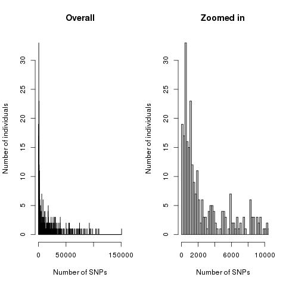

# Polychaetes GBS

## Description

SNP calling for Polychaetes collected along the Australian coast and sequenced paired end with a Pst1 restriction.

### Key Players

Amanda Padovan (Postdoc, Csiro, AU)
Ceridwen Fraser (PI)

### Physical location of the data

For now, the raw data is on the Otago high capacity storage:

smb://storage.hcs-p01.otago.ac.nz/sci-bioinformatics-project-archive/CeridwenPolychaetes

contact dutoit.ludovic@gmail.com for access.

### SNP Calling

The SNP calling is in [SNPcalling.md](SNPcalling.md) with Stacks/2.41

### Output files

There are three output folders, an unfiltered vcf allowing missing data to be filtered downstream and two attempts for filtering out low quality individuals and low quality SNPs. In each of these folders there is a list of all individuals remaining in the popmap file as well as a vcf. In the filtered folders, there are also input for a series of classical popgen software such as structure, treemix or plink. 

*ATTENTION: Some of the files have similar names across folders*

 * [output/ufiltered](output/unfiltered/popmap_all_nonull2.txt): Contains a completely unfiltered vcf file except for a max obs. heterozygosity of 0.65 to limit paralogy problem. he list of individuals is in [popmap_all_nonull2.txt]((output/unfiltered/popmap_all_nonull2.txt). Mostly all individuals remain except the two without data

* [output/filtered33percent](output/filtered33percent) Filtered out 33% of the individuals with the smallest SNP numbers. **Retained 319 individuals with 1857 SNPs**. The list of individuals is in [popmap_filtered30percent.txt](output/filtered30percent/[popmap_filtered40percent.txt).

* [output/filtered40percent](output/filtered40percent):Filtered out 33% of the individuals with the smallest SNP numbers. Retained  **286 individuals with 2829 SNPs**. The list of individuals is in : [popmap_filtered40percent.txt](output/filtered40percent/[popmap_filtered40percent.txt).

The number of SNPs per individual before filtering can be visualised below:

